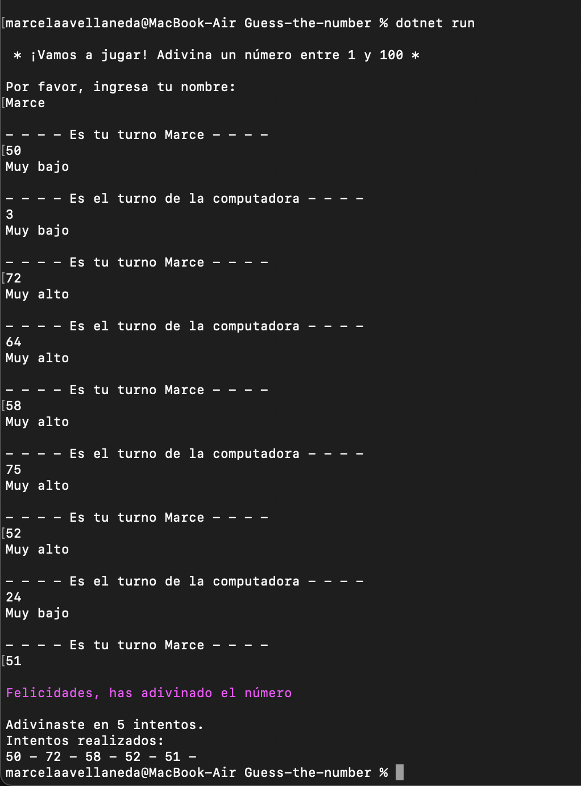

# Guess-the-number

Guess The Number es un juego interactivo que se desarrolla en el terminal, donde la jugadora y el ordenador se turnan para intentar adivinar un número aleatorio entre 1 y 100. Deben tener en cuenta la tentativa anterior, si fue "muy alta" o "muy baja". El juego termina cuando la jugadora o el ordenador adivinan el número. Se muestra la cantidad de intentos y los números que utilizó la ganadora en su intento.

### El proyecto



El juego comienza con un mensaje de bienvenida y solicita el nombre de la jugadora, permitiendo dejar el campo vacío con solo presionar Enter.

Luego, en cada ronda, la jugadora escribe su número para adivinar y recibe una pista para su próximo intento.

Cuando alguna de las dos adivina el número, el juego termina y se muestran algunas estadísticas.

Para ejecutar el juego, utiliza el comando:


```bash
  dotnet run
```

### Tecnologías

- C#
- .NET
- MsTest
- Programación Orientada a Objetos (OOP)


